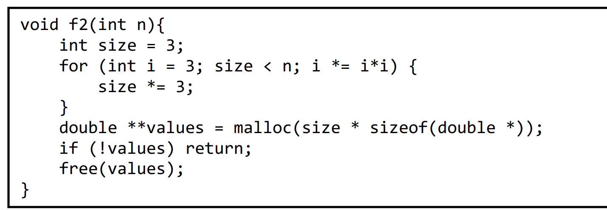

# Time
Notice how $i$ is not interesting at all (bait)\
$\mathrm{size}$ starts as $3$ and triples itself until it reaches $n$\
Let's look at the $k$-th step
$$
size_k = 3^k
$$
So we're looking for $3^{k} < n $
$$
3^{k} < n \underset{\log_3\left(\right)}{\implies} k < \log_3\left(n\right)
$$
The base of the log does not matter (since it amounts to multiplying by a constant which is $\Theta\left(1\right)$)\
In this class we are treating malloc as $\Theta\left(1\right)$ Time so at the end it's\
$$
\boxed{\Theta(\log\left(n\right))}
$$
# Space
The only auxiliary space taken is at the malloc (since there is no recursion)\
It allocates a space of size times the size of a double pointer, the size of a double pointer is constant so this isn't interesting\
We have $\Theta\left(\mathrm{size}\right)$ space complexity.\
Since at teh end of the function $\mathrm{size}=n$ it ends up as
$$
\Theta\left(n\right)
$$